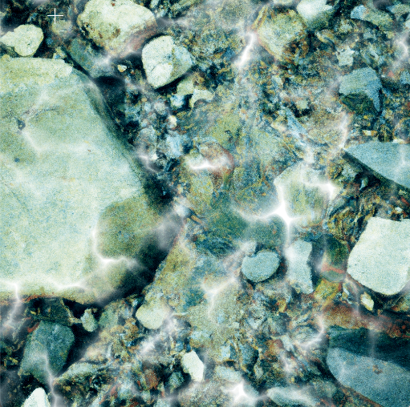
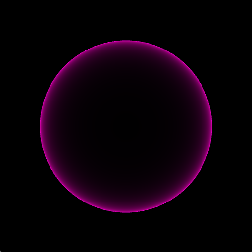
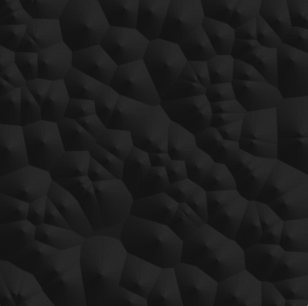
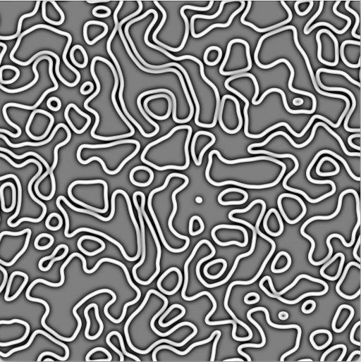
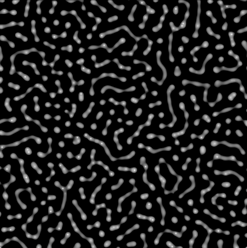

# Lygia Study Examples (Work in progress)

A repo of examples while studying the excellent shader library lygia by @patriciogonzalezvivo.
<br><br>

## Why

I wanted to understand how and what all the functions from lygia do.
<br><br>

## How to use

The easiest way to run the examples is to run the command lines on each Readme on each folder and check the examples live. For now all will leave under this Readme since there are not many examples.
<br><br>

### Distort

**Barrel**

```
glslViewer distort/barrel.frag
```


<br>

### Draw

**Aastep**

```
glslViewer draw/aastep.frag
```


<br>

### Generative

**Worley**

```
glslViewer generative/worley/worleyNoise.frag generative/worley/riverbed.png
```



<br>

### Lighting

**Fresnel**

```
glslViewer lighting/fresnelExample.frag
```



<br>

### SDF

**Sample**

```
glslViewer sample/bumpMap.frag sample/bumpMap.jpg
```



<br>

**Flow**

```
glslViewer sample/flow.frag sample/flow.jpg
```



<br>

### SDF

**CubeSDF**

```
glslViewer sdf/CubeSDF.frag
```


<br>

### Simulate

**Scott**

```
glslViewer generative/worley/worleyNoise.frag generative/worley/riverbed.png
```


